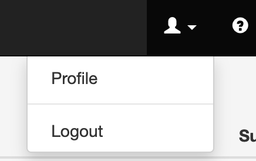

import Image from '@theme/IdealImage';

# Local User

Once signed in, a user may consult its profile attributes and possibly change his authentication means, like passwords, 2 factor authentication etc... (if managed by the APIO core platform).

## Profile

### Details

<Image img={require('./img/local_user_profile.png')} />

| Property | Description |
| --- | --- |
| Username | The user's username. (refer to the IdP username if the user is managed by an external IdP) |
| Firstname | The user's first name. |
| Lastname | The user's last name. |
| Mobile number | The user's mobile number. |
| Email | The user's email address. |
| System | Whether the user has the system level flag. |
| Profile | The user's profile. |
| UI Profile | The user's UI profile. |
| Registered on | The date the user was registered. |
| Language | The user's language. (may differ from the language set in the IdP) |
| Timezone | The user's timezone. |
| Roles | The user's roles for manual actions to be assigned on the platform. |
| Properties | The user's properties. |
| New password | The user's new password. |
| Confirm new password | The user's new password confirmation. |
| Current password | The user's current password. (mandatory when changing current password) |
| M2M token | The user's API token. |
| 2FA option | The user's 2FA option. |
| Passkeys | The user's passkeys to be used for Passwordless authentication (Webauthn). |

:::danger

M2M tokens should be treated as passwords. They are used to authenticate the user to the APIO core platform. 
If a token is lost or compromised, it should be removed or a new one should be generated. 
As a security measure, the token can be generated for a fixed period of time using an expiry date.

:::

### Callbacks

When a user represent another system, that system may need to be called back when a workflow (triggered by that user) is completed or blocked for further action.

### Trusted Loc.

When 2FA is enabled (either globally or per user), the user may consult and manage his trusted devices and locations.

### Login attempts

The user may consult the 5 last login attempts made on his account whether they were succesful or not.

### IP Whitelist

The user may consult and manage his IP whitelist. This list is used to restrict the IP addresses from which the user can sign in. This is especially useful when the user is an external system (the traffic always come from the same ip network).
