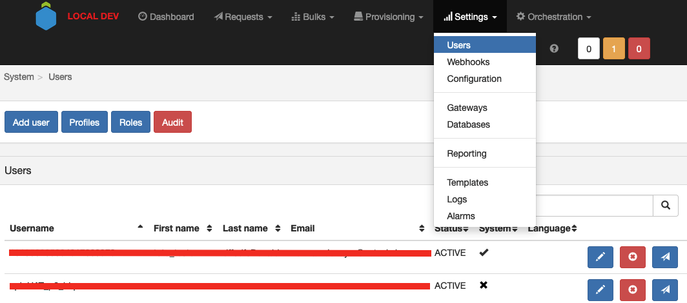

# Users

Users are the people who can access the APIO core software. They can be local users (stored in the APIO core software database) or external users (managed in an external system).

## Listing

