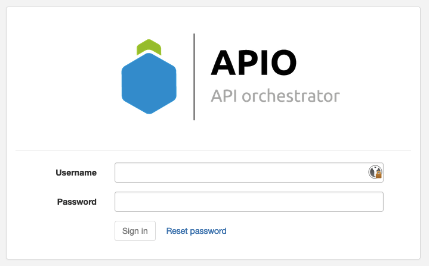
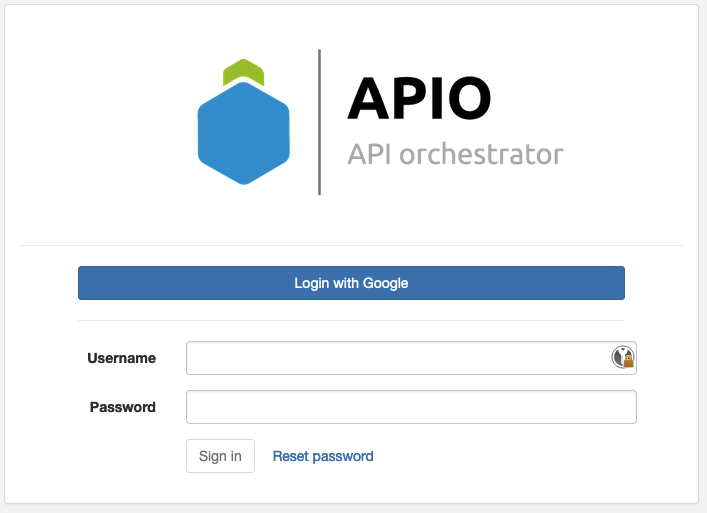
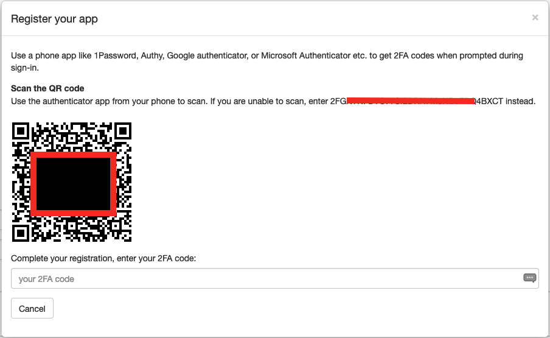
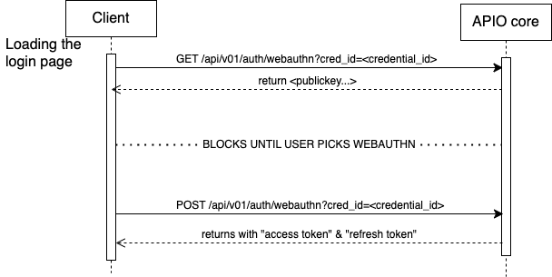

import Image from '@theme/IdealImage';

# Authentication

APIO core supports multiple authentication mechanisms. You can use them to authenticate your users and to authenticate your API calls.

At the end of each authentication process, the user gets a JWT token. The JWT token is used to authenticate the API calls by adding it to the `Authorization` header (Bearer [authentication scheme](https://developer.mozilla.org/en-US/docs/Web/HTTP/Authentication)) of the HTTP requests.

:::info

Refer to the [configuration documentation](configuration/sso) to configure the authentication mechanisms.

:::

## Local users 

Local users are users that are stored in the database of the APIO core. They are the default users of the APIO core. They are used to authenticate the users of the APIO core UI and to authenticate the API calls.

On the login page, they use their username and password to authenticate.



### Broadsoft users

The Broadsoft platform can be integrated as IdP for the APIO core users. So, the users of the Broadsoft platform can be used as the users of the APIO core, using the same username and password.

### Login API

```http
POST /api/v01/auth/login HTTP/1.1
Host: api.example.com
Content-Type: application/json

{
  "username": "user",
  "password": "password"
}
```

#### Response

```http
HTTP/1.1 200 OK
{
    "access_token": "...",
    "refresh_token": "..."
}
```

#### Response when the user has an M2M token set

```http
HTTP/1.1 200 OK
{
    "access_token": "...",
    "refresh_token": "...",
    "token": "..."
}
```

:::tip

The `token` is the M2M token of the user. It is meant to be immutable and it can be used as the access token for the API calls.

:::


### Sequence for regular login


## Single Sign-On (SSO)

APIO core supports SSO authentication using the [OpenID Connect](https://openid.net/connect/) and [SAML](https://saml.org) . It allows you to use your existing identity provider to authenticate your users in the APIO core.

On the login page, they use the button of the identity provider to authenticate.



### Sequence for OIDC authentication


## Two-Factor Authentication (2FA)

APIO core supports two-factor authentication (2FA) using email and TOTP (Time-based One-Time Password).

The 2FA is optional and can be enforced for all users with a mail address using the `Force 2-factor auth.` configuration parameter in the GUI section (see [configuration documentation](configuration/gui)).

### Email 2FA

To be able to use the email 2FA, the `2-factor auth. email template` configuration parameter in the GUI section (see [configuration documentation](configuration/gui)) must be set.

Then a user can enable 2FA in the user profile page of the APIO core UI.


After a successful login, the user receives an email with a 2FA code. The user has to enter the 2FA code to authenticate.

### TOTP 2FA

To be able to use the TOTP 2FA, the `2-factor auth. TOTP issuer` configuration parameter in the GUI section (see [configuration documentation](configuration/gui)) must be set.

Then a user can enable 2FA in the user profile page of the APIO core UI.




After a successful login, the user has to enter the 2FA code generated by the TOTP application (e.g Google authenticator) to authenticate.

### Login response when Two-Factor Authentication is required from the user

```http
HTTP/1.1 200 OK
{
    "2fa_payload": "...",
    "option": "email | totp"
}
```

| option | description |
| ------ | ----------- |
| email | The user has to enter the 2FA code sent by email. |
| totp | The user has to enter the 2FA code generated by the TOTP application (e.g Google authenticator) |

Then the client is supposed to send the 2FA code to the 2FA API.

```http
POST /api/v01/auth/2fa HTTP/1.1
Host: api.example.com
Content-Type: application/json

{
  "2fa_payload": "...",
  "code": "..."
}
```

The response contains the JWT tokens.

### Sequence for login with 2FA required


## Passwordless login API (using WebAuthN)

refer to the [Web Authentication API documentation](https://developer.mozilla.org/en-US/docs/Web/API/Web_Authentication_API)

Passwordless login is a login method that uses a physical device (e.g. a security key) to authenticate the user. The user does not need to enter a password to authenticate.



## Refresh token

The access token can be used to make API calls for a short period of time. After that, the access token expires and the client needs to use the refresh token to get a new access token.

```http
GET /api/v01/auth/access_token HTTP/1.1
Host: api.example.com
Authorization: Bearer <refresh_token>
```

### Response

```http
HTTP/1.1 200 OK
{
    "access_token": "...",
    "refresh_token": "..."
}
```

:::info

A new refresh token is sent only when the refresh token is about to expire.

:::

# Reset password

Local users and Broadsoft users (if the Broadsoft platform is integrated as IdP) can reset their password using the reset password API.

The reset password API sends an email to the user with a link to reset the password. By default the link is valid for 20 minutes.

The email template is selected by the `reset_password_email_template` configuration parameter in the GUI section (see [configuration documentation](configuration/gui)).

The template name is `mails.reset_password` by default, but it can contain the following variables to customise the email based on criteria:

| Variable | Origin | Description |
| -------- | ------ | ----------- |
| `{ui_id}` | Request body | The ID of the UI interface. <br /> This to align the branding of a different mail with a different portal. |
| `{ui_language}` | Request body | The language of the UI interface. |
| `{proxy}` | Request body | A proxy name used when multiple Broadworks proxies coexists in the same platform. |
| `{language}` | User profile | The language of the user. |

e.g `mails.reset_password.{ui_id}.{language}` or `mails.reset_password.{ui_id}`.

Such reset password email can only be sent once every 5 minutes.

:::caution

For security reasons, the reset password API does not return any error if the user does not exist.

:::

:::info

Other users (SSO users) can reset their password using the reset password API of the IdP.

:::

## Customisation

The reset password process might require some customisation to fit specific needs (e.g. custom email API, setting user password in different places).

The reset password API process can be configured to use a custom process by setting the `Reset password notification workflow` and `Post-reset password workflow` configuration parameter in the GUI section (see [configuration documentation](configuration/gui)).

### Notification flow

<Image img={require('./img/reset-password-notification-flow.png')} />

### Execution flow

<Image img={require('./img/reset-password-exec-flow.png')} />