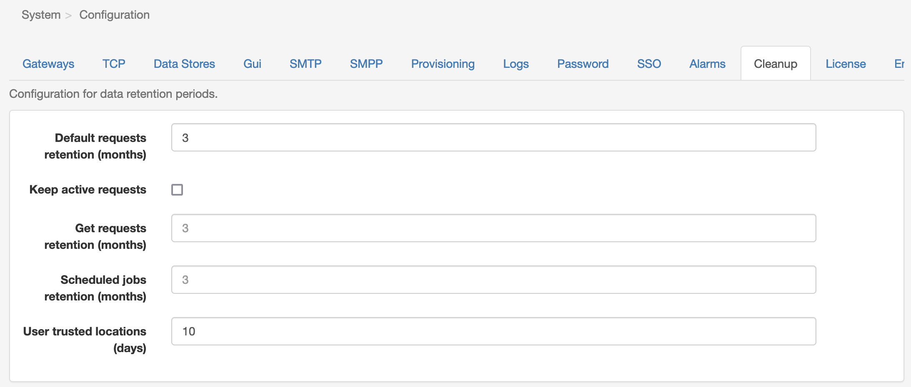

# Cleanup

APIO core can cleanup the history data in the database automatically. Performed at night, the cleanup process will remove the old data from the database.

| Property | Description |
| --- | --- |
| Default requests retention (months) | Default retention period for all requests and instances. |
| Keep active requests | Save active requests from the cleanup process. (when enabled, the requests / instances in status ACTIVE are kept in the database until they are closed) |
| Get requests retention (months) | Retention period for requests triggered with an HTTP method 'GET'. If not set, the default retention period applies. However, for some platforms getting a lot of GET requests, the retention period might be shorter than the default one. |
| Scheduled jobs retention (months) | Rretention period for scheduled jobs. |
| User trusted locations (days) | Retention period for user trusted locations when they choose to trust their machine during the 2FA process. If that property is not filled the 2FA process is triggered every time. |
