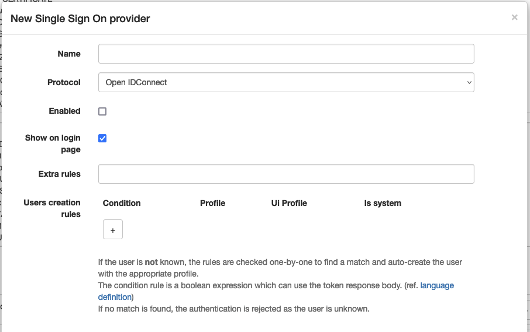
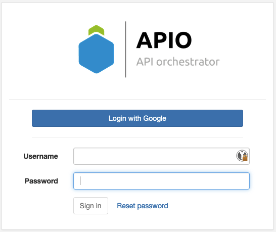

# SSO

APIO core supports SSO (Single Sign-On) via a bunch of protocols.

Single sign-on (SSO) is an authentication scheme that allows a user to log in with a single ID and password to any of several related, yet independent, software systems. True single sign-on allows the user to log in once and access services without re-entering authentication factors.

It allows users to authenticate themselves on one platform and then use the same credentials to access other platforms within the same organization. So they don't need to be provisioned or authenticated on each platform.

## Login page

The login page may display an SSO button to allow users to login via SSO if the provider entry is configured.

The button label is `Login with ` followed by the name of the provider entry.

## Extra rules

Even if the IdP accept the authentication, APIO core may reject it if the user doesn't match some extra rules. (e.g. the user is not in the correct group / organization)

The rules are simple expression based on the element of the token IdP decoded. (e.g `hd == 'mycompany.com'`)

## User creation rules

When a user is authenticated via SSO, APIO core may create the user if it doesn't exist.

The rules are a mapping between the elements of the token IdP decoded and user profiles definitions.

:::caution

If no rules exists or no rule match, the user is not created. And the authentication is rejected.

:::

## Protocols

### OpenID Connect

### SAML

### Webseal

### Soap Token

### Broadsoft
