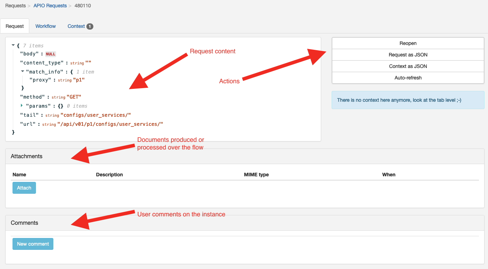
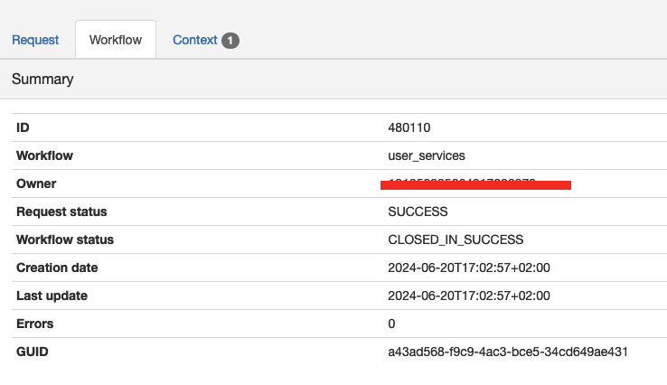
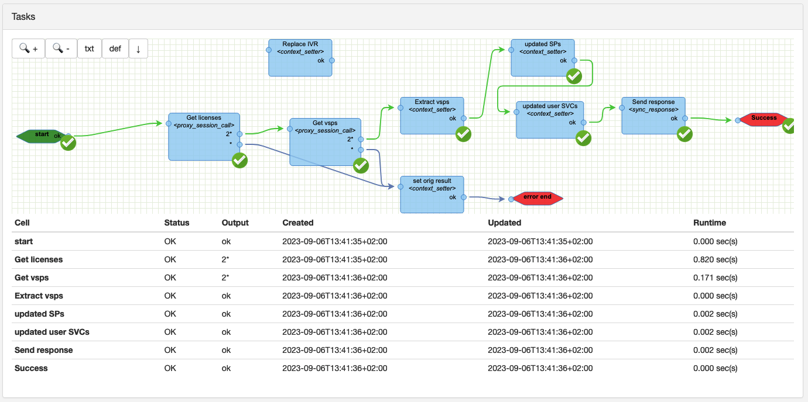
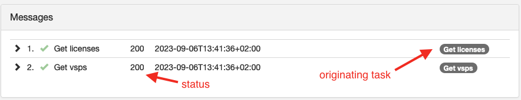
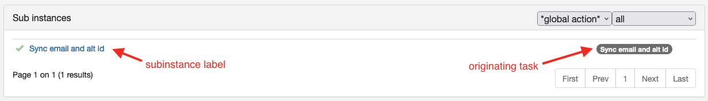

# Requests

Every request sent to APIO core is logged in the database. So a user can see the history of the requests. Search for activities or issues and see the details of each request.

## Search

The possible search criteria are (they can be influenced by the combination of modules activated in the GUI section of the configuration):

- **Workflow**: The activity of the request.
- **Owner**: The user who triggered the request.
- **Workflow status**: The status of the workflow (this is an internal status indicating if the workflow is either `active`, `completed` or `completed with errors`).
- **Request status**: The status of the request. (this is a status which can be set by the workflow itself).
- **Pending action role**: The role of the user who should perform an action on the request.
- **Tenant ID**: When integrated with Broadsoft, the tenant ID is the Broadsoft enterprise ID.
- **Site ID**: When integrated with Broadsoft, the site ID is the Broadsoft group ID.
- **Number**: When integrated with Broadsoft, the number is the Broadsoft user ID.
- **Proxy host**: The host of the proxy used to process the request.
- **Proxy status**: The HTTP status code of the proxy response.
- **Proxy URL**: The URL called on the proxy process.
- **Proxy method**: The HTTP method of the proxy request.
- **Created on**: The date when the request was created.
- **With tasks in error**: The request contains tasks in error.
- **With 'end' in error**: The request contains an 'end' task in error.

:::info

When the Broadsfot integration is enabled, and the request is not overloaded by custom routes, the request is proxied and doesn't trigger any workflow instance. In this case, it has no workflow.

:::

## Request details

Every calls to custom routes (public or not) are logged in the database. So a user can see the details of the requests and their execution.

Details are split in 3 tabs

### Request

The request is displayed in a JSON viewer with at least the following attributes.

| Attribute | Description |
| --------- | ----------- |
| **body** | The body of the request. If the request was started with a multipart body containing files, they will appear in the `Attachments`section below. The body might be represented in a base64 encoded format if it cannot be parsed from the input stream. |
| **content_type** | The content type of the request. |
| **match_info** | The parameters extracted from the URL match. |
| **method** | The HTTP method of the request. |
| **params** | The query string of the URL request. |
| **tail** | The tail of the URL request. (the part of the URL path after the prefix) |
| **url** | The URL of the request. |

On the right side of the JSON viewer, there is a set of buttons to
- **Force close / Reopen**: Forcibly close the instance or reopen it.
- **Request as JSON**: Download the request as a JSON file.
- **Context as JSON**: Download the context as a JSON file.
- **Auto-refresh**: Enable or disable the auto-refresh of the request / workflow details.

### Workflow

The details of the workflow execution starting with a summary.

| Attribute | Description |
| --------- | ----------- |
| **ID** | The sequential ID of the workflow instance. |
| **Workflow** | The name of the workflow executed. |
| **Owner** | The user who triggered the workflow (empty when the route is public). |
| **Request status** | The status of the request. (this is a status which can be set by the workflow itself). |
| **Workflow status** | The status of the workflow (this is an internal status indicating if the workflow is either `ACTIVE`, `CLOSED_IN_SUCCESS` or `CLOSED_IN_ERRORS`). |
| **Creation date** | The date when the workflow instance was created. |
| **Last update** | The date when the workflow instance was last updated. |
| **Errors** | The number of errors in the workflow instance. |
| **GUID** | The GUID of the workflow instance. |

#### Workflow details

The execution of the workflow is displayed in the form of the workflow editor. The nodes are displayed with their status and the links are colored with their status.

The workflow viewer is interactive. The user can double click on the nodes to see their details. But they can't be edited.

It also contains a set of buttons to
- **zoom in/out**
- **txt**: see the workflow definition as a text (JSON representation).
- **def**: open the workflow definition in the workflow editor.
- **download**: update the workflow definition with the current active definition.

Then there is a table with the list of tasks executed and their execution status.

| Attribute | Description |
| --------- | ----------- |
| **Cell** | The name of the task. |
| **Status** | The status of the task. |
| **Output** | The output of the task. |
| **Created** | The date when the task was created. |
| **Updated** | The date when the task was last updated. |
| **Runtime** | The duration of the task. |

#### Messages

When there is a message exchanged by a node, it is displayed in the messages tab.

Every entries contain the details of the request and response in a JSON form.

:::info

In the case of a message exchanged with Broadsoft through the Broadsoft gateway, the details are enriched with the OCI exchanges.

:::

#### Sub workflows

When there is a sub workflow executed, it is displayed in the sub workflows panel.

Sub instances can be filtered with the following criteria:
- **all**: All sub instances.
- **active**: Only the active sub instances.
- **active & blocked**: Only the active and blocked sub instances.

Then an action can be performed on the selected sub instances:
- **replay**: Replay the tasks in error in the selected sub instances.
- **skip**: Skip the the tasks in error in the selected sub instances.
- **force close**: Force close the selected sub instances.

#### Errors

When there is an error in the workflow, a panel is displayed with the details of the error.

#### Events

A panel is displayed with the list of events received by the workflow. This can be useful to debug the workflow.

### Context

The instance context refer to the context of the workflow instance. It is a set of key-value pairs that can be used by the workflow tasks to store data over execution. (sensitive data like passwords, tokens etc... are obfuscated)

## Proxied request details

Because there is no workflow executed on this request, the view is very simplified.
