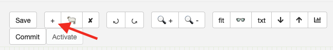
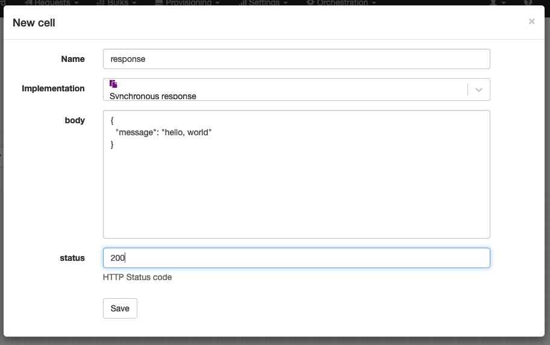
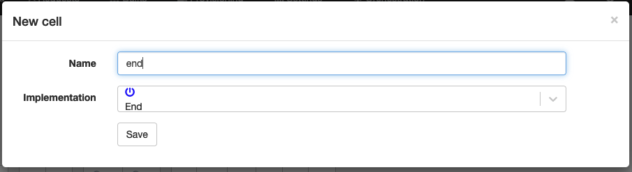
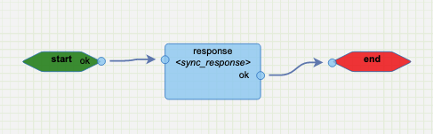
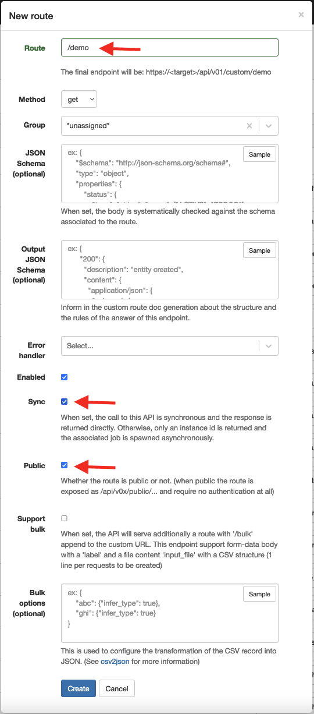
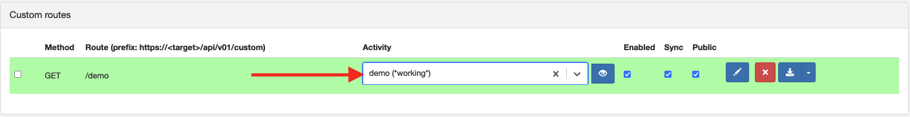

# Welcome to APIO core engine

APIO core is a simple workflow engine with great extensibility.

## Getting Started

Get started by **creating a new workflow**.

Go to <a href="/../../transactions/config/activities/editor" target="_blank">Activity Editor</a>.

Create a new activity named `demo`.

### Something simple

Add a nodes to prepare a static content.





Add a node to complete the workflow.



Wire the nodes together.



Save


## Bind to an HTTP endpoint

### Create a new route endpoint

Go to <a href="/../../transactions/config/startup_events" target="_blank">Startup events</a>.

Create a new route.



### Bind to your activity



## Call your endpoint

Call your endpoint with any HTTP client:

```bash
curl http://<host>/api/v01/public/demo
{"message":"hello, world"}
```
