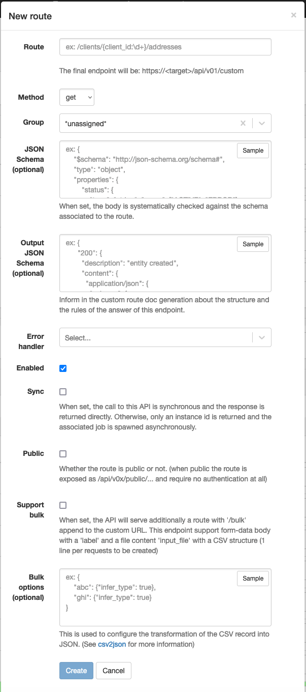

# Custom routes

APIO core supports custom HTTP routes. You can use them to expose your workflows to create your own API calls.

Page: `/transactions/config/startup_events`

### Definition

| Attribute | Description |
| --------- | ----------- |
| Route | The path of the route. |
| Method | The HTTP method of the route. |
| Group | The group of the route. |
| JSON Schema | The request body can be validated with a JSON schema before launching the workflow. |
| Output JSON Schema | The response body can be described for the OpenAPI generator. |
| Error handler | The workflow to launch when an error occurs. |
| Enabled | The route is enabled. |
| Sync | The route is synchronous. |
| Public | The route does not require authentication. |
| Support bulk | The route supports bulk requests. |
| Bulk options | The options of the bulk requests. |

## Synchronous vs Asynchronous routes

The custom routes can be synchronous or asynchronous. The synchronous routes are executed in the same thread as the HTTP request. The asynchronous routes are executed in a separate thread.

The synchronous routes are useful when the workflow is fast. The asynchronous routes are useful when the workflow is slow. The asynchronous routes are also useful when the workflow is long-running. In this case, the workflow can be launched in a separate thread and the HTTP request can be closed. The workflow can continue to run in the background.

When the route is asynchronous, the response is sent immediately. The response contains the ID of the transaction. The transaction can be used to track the status of the workflow. (via the API `GET /api/v01/transactions/{id}` or via the UI `/transactions/{id}`)

## Authenticated routes

By default, all custom routes are authenticated. The authentication is done using the JWT token. The JWT token is added to the `Authorization` header (Bearer [authentication scheme](https://developer.mozilla.org/en-US/docs/Web/HTTP/Authentication)) of the HTTP requests.

Such routes are exposed under the `/api/v01/custom` path. For example, the route `/my-route` is exposed as `https://api.example.com/api/v01/custom/my-route`.

## Public routes

The custom routes can be public. In this case, they do not require authentication. Such routes are exposed under the `/api/v01/public` path. For example, the route `/my-route` is exposed as `https://api.example.com/public/my-route`.

Public routes are useful when you want to expose your workflows to external systems in a secure environment. (e.g. a private network or health check)

## Proxied routes

APIO core can be deployed with one or several proxies to intercept and/or forward some traffic to a Broadsoft gateway. In this case, the proxy process will use the custom routes to *overload* or *extend* the Broadsoft gateway API calls.

Proxied routes are usually exposed under the `/api/v01/p{id}` path. For example, the route `/my-route` is exposed as `https://api.example.com/api/v01/p1/my-route`.

All proxied routes require the user to be authenticated.

Some nodes are especially usefull in the context of the proxied routes, e.g. [Proxy user session](../workflows/nodes/#broadsoft-proxy-session-call) node, to use the user session to make calls to the Broadsoft gateway.
