# Nodes

Nodes are the building blocks of a workflow (a.k.a cells).

## Start

Technical name: `start`

Every workflow must have one and only one start node.

This is a technical node which has no attributes.

## End

Technical name: `end`

Mark the end of a workflow.

A workflow has to contain at least one end node. But it can have more than one end node.
Especially in `macro` workflows, it is common to have multiple end nodes with names named after possible outputs.

## HTTP call

Technical name: `http_call`

Execute an HTTP call and assign the result to a context variable.

The call can be executed on a *session holder* (defined in the configuration and using a relative url) or on a new session (using a full URL, e.g `http://example.com/api/users`).

The result of the call is a dictionary with the following keys:

- `status`: The HTTP status code of the response.
- `body`: The body of the response.

The result of the call is assigned to the context variable defined in the `output_context_key` attribute.

It can also be assigned to a cache key if the `cache_key` attribute is defined.
If the HTTP method is `GET`, the result will be cached and the cache will be used for subsequent calls. If the HTTP method is not `GET`, the cache will be invalidated.

If the returned status code is not in the `http_codes` attribute, and the `error` output is not linked to another node, the node will fail.

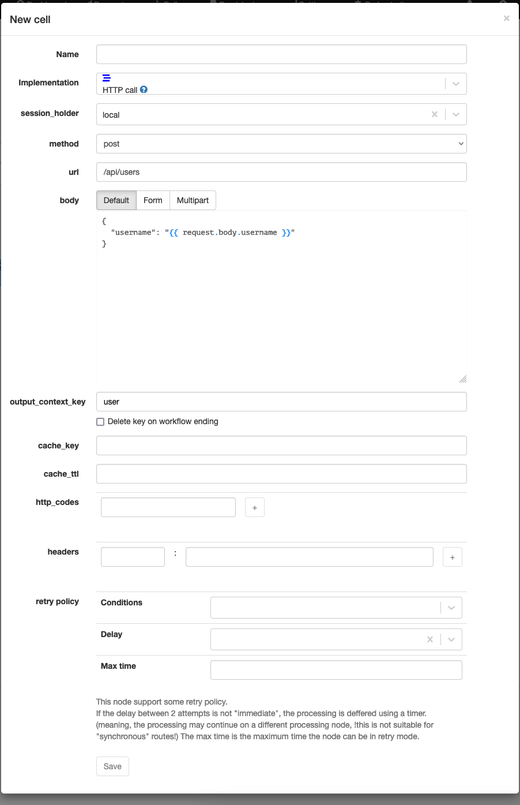

| Attribute | Description |
| --- | --- |
| session_holder | The session holder to use. |
| method | The HTTP method to use. |
| url | The URL to call. |
| body | [optional] The body of the request. |
| output_context_key | The context variable to assign the result to. |
| cache_key | [optional] The cache key to use. |
| cache_ttl | [optional] The cache timeout to use. |
| http_codes | [optional] The HTTP codes to consider as outputs of the nodes.   The `*` can be used to include multiple codes. |
| headers | [optional] Extra headers of the request. |

## rest_call

## json_call (deprecated)

use `http_call` instead.

## async_json_call

## xml_call

## bsft_call

## proxy_session_call

## proxy_call

## tcp_call

## Context setter

Technical name: `context_setter`

Set a context variable to a value.

If the key already exists, it will be overwritten.

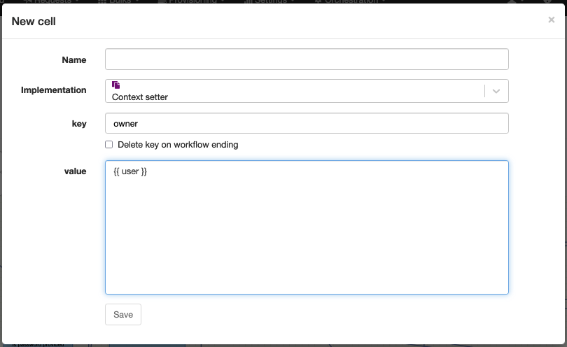

| Attribute | Description |
| --- | --- |
| key | The context variable to set. |
| value | The value to set. |

## multi_context_setter

## sync_response

## callback_response

## trigger_manual_action

## cancel_manual_action

## send_email_template

## send_sms

## sql_exec

## sql_exec_with_return

## SQL Select

Technical name: `sql_select`

Execute a SQL query and assign the result to a context variable.

For security reasons, it's highly recommended to use variables in the query instead of directly using the `query` attribute (avoid SQL injections with improper inputs).

The result of the query is a list of rows. Each row is a dictionary with the column names as keys.

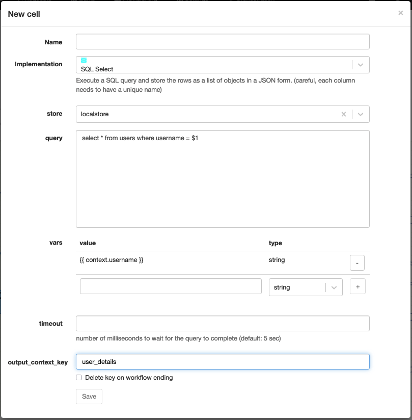

| Attribute | Description |
| --- | --- |
| store | The datastore to use. |
| query | The SQL query to execute. |
| vars | [optional] A list of variables to use in the query. |
| timeout | [optional] The timeout of the query. |
| output_context_key | The context variable to assign the result to. |

## Boolean expression

Technical name: `boolean_expression`

Evaluate a boolean expression and trigger a different path depending on the result (true or false).

Boolean expression is evaluated in the context of the current request as Jinja2 template *and* Python3 expression.

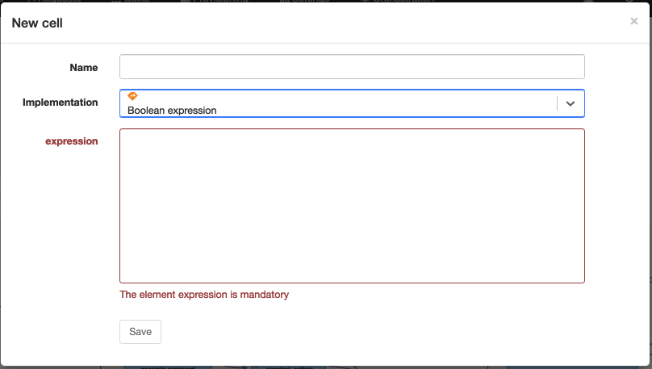

| Attribute | Description |
| --- | --- |
| expression | The boolean expression to evaluate. |

## Switch

Technical name: `switch`

Execute a different path depending on the evaluation of a set of conditions.

Conditions are boolean expressions resolved in order. The first condition which evaluates to true will be executed.
If no condition evaluates to true, the "default" path will be executed.

Boolean expressions are evaluated in the context of the current request as Jinja2 templates *and* Python3 expressions.

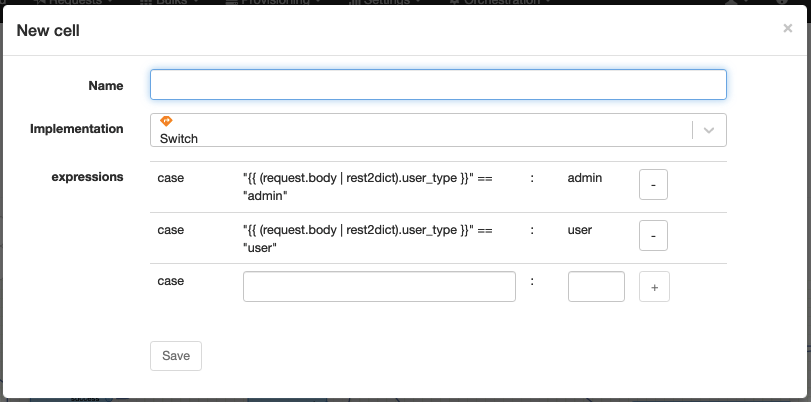

| Attribute | Description |
| --- | --- |
| expressions | A list of boolean expressions to evaluate. |

## Or

Technical name: `or_outputs`

Wait for one of the inputs to be executed before continuing the workflow. Only one input will pass through the node and continue the execution.

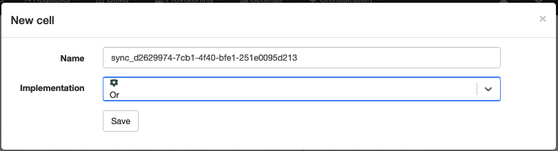

## Join

Technical name: `sync_outputs`

Wait for multiple inputs to be executed before continuing the workflow. All inputs must be executed before the workflow can continue.

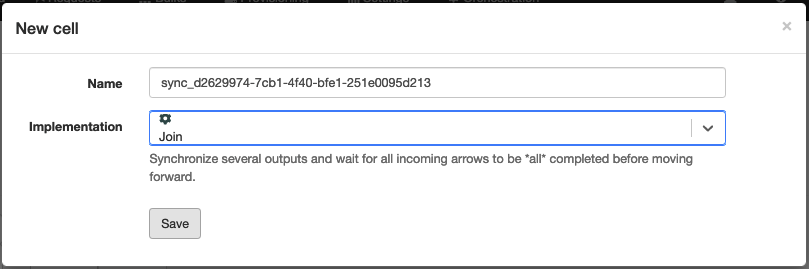

## Timer

Technical name: `timer`

Wait for a certain amount of time. If the timer is shorter than 20s it will be executed synchronously. Otherwise it will be executed asynchronously. When the timer is synchronous, it can't be stopped.

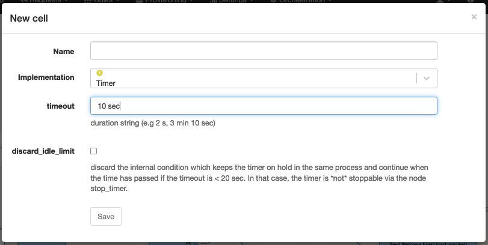

| Attribute | Description |
| --- | --- |
| timeout | The duration of the timer.   This is a string representing a duration (e.g 2 sec, 3 min). |
| discard_idle_limit | Discard the internal behaviour to keep the timer synchronous if the timeout is less than 20s. |

## Context timer

Technical name: `context_timer`

Use a context variable to define the start and the duration of the timer.

Multiple timers can be started with the same key. If a timer is started with the same key as an active timer, the active timer can be cancelled.

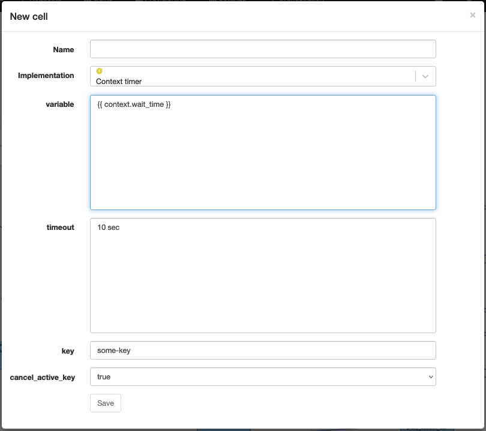

| Attribute | Description |
| --- | --- |
| variable | The start of the timer.   This is a string representing a date (e.g 2021-01-01 00:00:00). |
| timeout | The duration of the timer.   This is a string representing a duration (e.g 2 sec, 3 min). |
| key | [optional] A timer key identifier |
| cancel_active_key | Whether to cancel active timers with the same key. |

## Stop timer

Technical name: `stop_timer`

Stop a timer.

## Generate OTT

Technical name: `generate_ott`

Generate a one-time token and assign it to a context variable. One-time token are useful to generate a link to an action which can only be used once (e.g reset a user password).

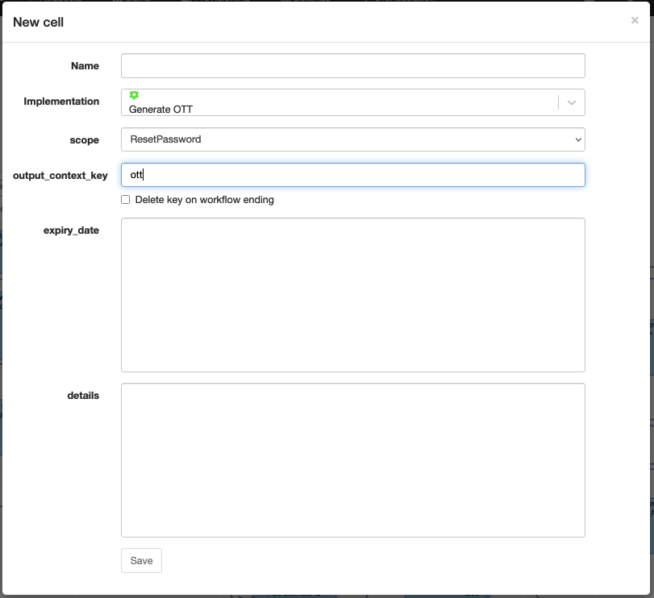

| Attribute | Description |
| --- | --- |
| scope | The scope of the generated one-time token.   This is a string which is used to identify the action to perform. (a manual action, a reset password etc...) |
| output_context_key | The context variable to assign the generated one-time token to. |
| expiry_date | [optional] The expiry date of the generated one-time token.   This is a date in the format `YYYY-MM-DD HH:mm:ss`. |
| details | [optional] Additional details to store with the generated one-time token.   This is a JSON object. |

## Generate random string

Technical name: `generate_random_string`

Generate a random string and assign it to a context variable.

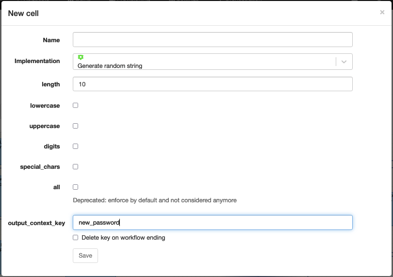

| Attribute | Description |
| --- | --- |
| lowercase | Whether to include lowercase characters in the generated string. |
| uppercase | Whether to include uppercase characters in the generated string. |
| digits | Whether to include digits in the generated string. |
| special_chars | Whether to include special characters in the generated string. |
| length | The length of the generated string. |
| output_context_key | The context variable to assign the generated string to. |

## Set Request status

Technical name: `set_request_status`

Assign a status to the current request.

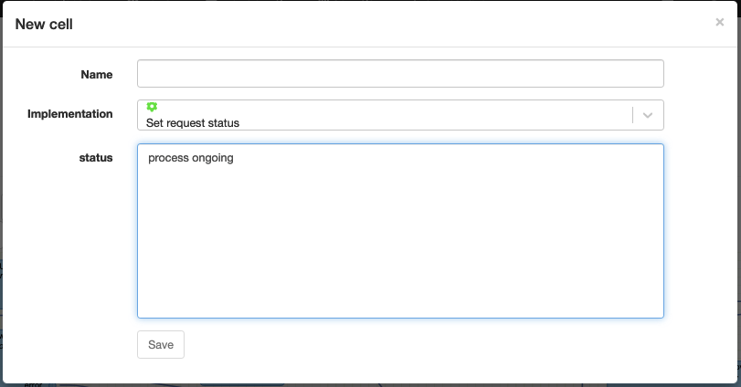

| Attribute | Description |
| --- | --- |
| status | The status to assign to the current request. |

## Set task status

Technical name: `set_task_status`

Change the status of a task. This is useful to mark a task in error and allow the user to replay a certain task in the workflow.

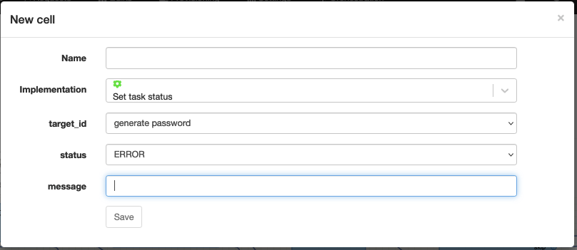

| Attribute | Description |
| --- | --- |
| target_id | The name of the task to change the status of. |
| status | The status to assign to the task. (ERROR or OK) |
| message | The error description. |

## macro

## trigger_subworkflows

## Create user

Technical name: `create_user`

Create a new user locally on the system.

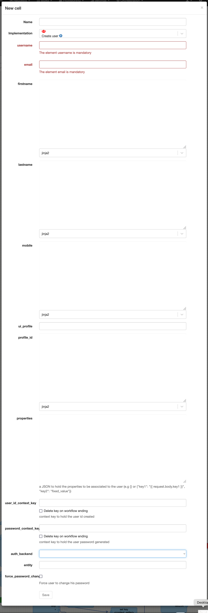

| Attribute | Description |
| --- | --- |
| username | The username of the new user. |
| email | The email address of the new user. |
| firstname | The first name of the new user. |
| lastname | The last name of the new user. |
| mobile | The mobile number of the new user. |
| ui_profile | The UI profile of the new user.   This only influence the view of the user in the APIO core UI. |
| profile_id | The profile of the new user.   This is the profile of the user in the APIO core engine. |
| properties | The properties of the new user.   This is a JSON object. |
| user_id_context_key | The context variable to assign the user ID to. |
| password_context_key | The context variable to assign the password to. |
| auth_backend | The authentication backend to use.   This is the name of the authentication backend as defined in the APIO core configuration. |
| entity | The entity of the new user. If it's set, the user is treated as a technical user for M2M exchanges. |

## update_user

## delete_user

## Get owner (deprecated)

Technical name: `get_owner`

Get the owner of the current request. Use `{{ user }}` in your template to access the owner attributes instead.

## search_transactions

## create_csv

## create_excel_sheet

## powershell

## ftp

## entity
