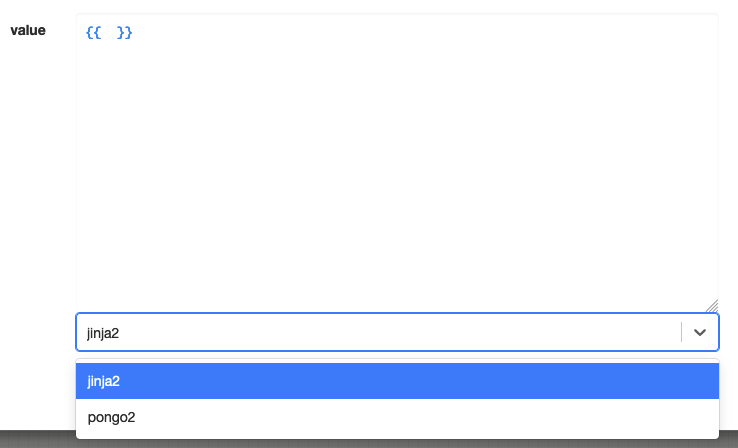

# Templates

Most fields in the nodes can be evaluated as templates. The default template engine is [Jinja2](https://jinja.palletsprojects.com/) and expose all the [buit-in's](https://jinja.palletsprojects.com/en/3.1.x/templates/#list-of-builtin-filters) of the language.

To debug easily such fields, you can use the <a href="/../../help/template-playground" target="_blank">playground</a>.

It is extended with the following elements.

## Filters

[From Jinja2](https://jinja.palletsprojects.com/en/3.1.x/templates/#list-of-builtin-filters)

| Filter | Description | Sample |
| --- | --- | --- |
| pp_dict | turn an object into a pretty-printed JSON string representation | <code>&#123;&#123; &#123;'a': 1, 'b': 2} &#124; pp_dict }}</code> |
| dict_filter | filter a dictionary with a set of keys | <code>&#123;&#123; &#123;'a': 1, 'b': 2, 'c': 3} &#124; dict_filter(['a', 'b']) }}</code> |
| json_query | inspect a JSON object with a JMESPath query | <code>&#123;&#123; &#123;'a': 1, 'b': 2, 'c': 3} &#124; json_query('a') }}</code> |
| url_qs | parse a URL query string into a dictionary | <code>&#123;&#123; 'a=1&b=2&c=3' &#124; url_qs }}</code> |
| url_raw_query | parse a URL query string | <code>&#123;&#123; 'a=1&b=2&c=3' &#124; url_raw_query }}</code> |
| json | parse a JSON string into a dictionary | <code>&#123;&#123; '&#123;"a": 1, "b": 2, "c": 3}' &#124; json }}</code> |
| url_path | extract the path from a URL | <code>&#123;&#123; 'http://localhost:8080/api/v01/public/demo' &#124; url_path }}</code> |
| combine | merge dictionaries | <code>&#123;&#123; &#123;'a': 1, 'b': 2} &#124; combine(&#123;'c': 3}) }}</code> |
| rest2dict | parse a REST call response into a dictionary (note: it automatically parse a `body` property as a JSON string into an object) | <code>&#123;&#123; rest2dict(rest) }}</code> |
| regex_replace | use a regular expression to replace a string | <code>&#123;&#123; 'hello, world' &#124; regex_replace('hello', 'goodbye') }}</code> |
| regex_findall | use a regular expression to find all matches in a string | <code>&#123;&#123; 'hello, world' &#124; regex_findall('l') }}</code> | 
| regex_search | use a regular expression to search a string | <code>&#123;&#123; 'hello, world' &#124; regex_search('l') }}</code> |
| unique | exclude duplicates from a list | <code>&#123;&#123; [1, 2, 3, 1, 2, 3] &#124; unique }}</code> |
| intersect | intersect two lists | <code>&#123;&#123; [1, 2, 3] &#124; intersect([2, 3, 4]) }}</code> |
| difference | difference between two lists | <code>&#123;&#123; [1, 2, 3] &#124; difference([2, 3, 4]) }}</code> |
| union | union of two lists | <code>&#123;&#123; [1, 2, 3] &#124; union([2, 3, 4]) }}</code> |
| min | minimum value of a list | <code>&#123;&#123; [1, 2, 3] &#124; min }}</code> |
| max | maximum value of a list | <code>&#123;&#123; [1, 2, 3] &#124; max }}</code> |
| b64encode | base64 encode a string | <code>&#123;&#123; 'hello, world' &#124; b64encode }}</code> |
| b64decode | base64 decode a string | <code>&#123;&#123; 'aGVsbG8sIHdvcmxk' &#124; b64decode }}</code> |
| phonenumber_valid | check if a phone number is valid | <code>&#123;&#123; '+33612345678' &#124; phonenumber_valid }}</code> |
| phonenumber_e164 | convert a phone number to E164 format | <code>&#123;&#123; '+33612345678' &#124; phonenumber_e164 }}</code> |
| phonenumber_cc | extract the country code from a phone number | <code>&#123;&#123; '+33612345678' &#124; phonenumber_cc }}</code> |
| phonenumber_cca | extract the country code from a phone number in alpha-2 format | <code>&#123;&#123; '+33612345678' &#124; phonenumber_cca }}</code> |
| phonenumber_type | extract the type of a phone number | <code>&#123;&#123; '+33612345678' &#124; phonenumber_type }}</code> |
| strftime | format a date | <code>&#123;&#123; '2021-01-01' &#124; strftime('%Y-%m-%d') }}</code> |
| to_datetime | convert a string to a datetime object | <code>&#123;&#123; '2021-01-01' &#124; to_datetime }}</code> |
| to_bool | convert a string to a boolean (evaluate to true: "yes", "on", "1", "true", 1) | <code>&#123;&#123; 'true' &#124; to_bool }}</code> |
| hmac | generate hash for a string, using a key (optional); supported digests: sha1, sha224, sha256 (default), sha384, sha512, blake2b, blake2s | <code>&#123;&#123; 'secret' &#124; hmac }}</code> <code>&#123;&#123; 'secret' &#124; hmac('key') }}</code> <code>&#123;&#123; 'secret' &#124; hmac('key', 'sha512') }}</code> |

## Tests

[From Jinja2](https://jinja.palletsprojects.com/en/3.1.x/templates/#list-of-builtin-tests)

| Test | Description | Sample |
| --- | --- | --- |
| startswith | check if a string starts with a substring | <code>&#123;&#123; 'hello, world' &#124; startswith('hello') }}</code> |
| endswith | check if a string ends with a substring | <code>&#123;&#123; 'hello, world' &#124; endswith('world') }}</code> |

## Functions

| Function | Description | Sample |
| --- | --- | --- |
| now | compute the current date and time | <code>&#123;&#123; now() }}</code> |
| tz | apply a timezone to a date | <code>&#123;&#123; now(tz('Europe/Paris')) }}</code> |
| timedelta | apply a delta to a date | <code>&#123;&#123; now() &#124; timedelta(days=1) }}</code> |
| utcnow | compute the current date and time in UTC | <code>&#123;&#123; utcnow() }}</code> |
| uuid | generate a UUID | <code>&#123;&#123; uuid() }}</code> |
| randint | generate a random integer | <code>&#123;&#123; randint(1, 10) }}</code> |

## Variables

[Assignments from Jinja2](https://jinja.palletsprojects.com/en/3.1.x/templates/#assignments)

| Variable | Description |
| --- | --- |
| request | the current request object.   Use <code>&#123;&#123; (request.body &#124; rest2dict).&lt;property&gt; }}</code> to access request body triggered by an HTTP custom endpoint |
| instance | the current instance object running a workflow with the following attributes: <ul><li>id</li><li>guid</li><li>callback_task_id</li><li>user_id</li><li>original_request_id</li><li>label</li></ul> |
| context | a key-value map attached to the current workflow instance |
| tasks | tasks ran until there with their status |
| sub_instances_responses | "callback" responses produced by sub-instances |
| parent_instance_context | context of the parent instance (only filled in sub-instance) |
| settings | a dictionary containing the settings of the platform (sensitive content are removed for security reason) |
| env | a dictionary containing the environment variables of the platform |
| proxy_name | the name of the proxy (only filled in processes started with proxy binding) |
| worker_env | a dictionary containing the environment variables of the worker process (note: it allows to attach different values depending on the running location) |
| user | the user object of the current user (only filled when the instance has an owner defined) |

## Alternatives

While jinja2 is the default template engine, you can use other engines by specifying the `engine` attribute in the field (just under the template in the editor).

:::tip

Jinja2 is a Python based template engine, so it is the most extensible and powerful engine available.
*But* because it is Python based, it is not the fastest engine available. If you have a lot of templates to evaluate, or templates with big data or slow templates, you may want to consider using a faster and lighter engine like Pongo2.

:::

### Pongo2

Documentation: [https://github.com/flosch/pongo2](https://github.com/flosch/pongo2)
